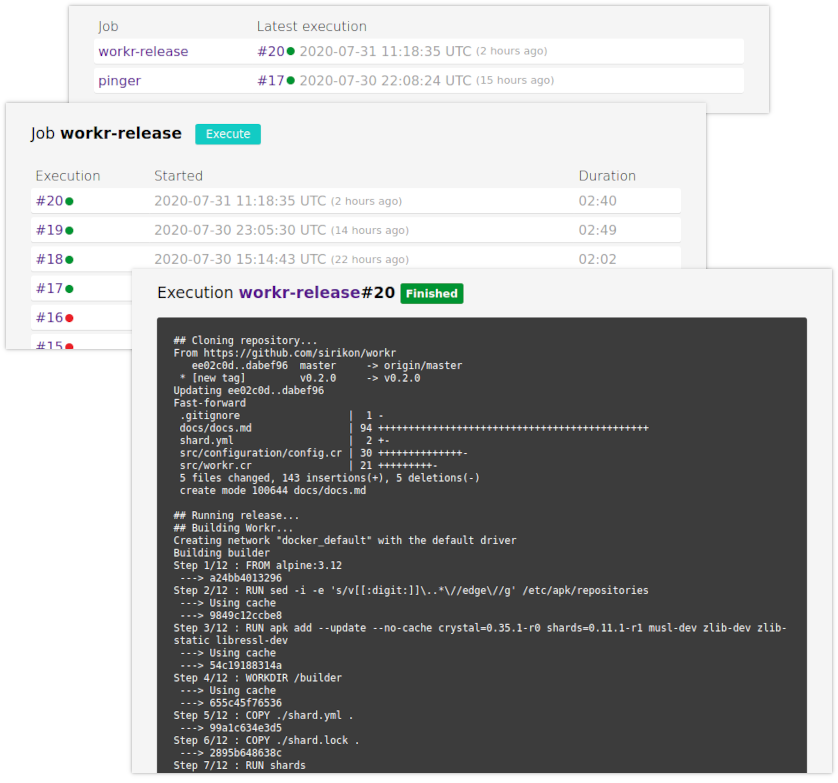

# Workr

Workr is a **simple** and **easy** to setup job runner for any kind of
automation. Think of it like a lightweight and super-simplified
[Jenkins](https://www.jenkins.io/) or a self-hosted
[CircleCI](https://circleci.com/) that you configure using **plain text files**
and each job is just a **runnable script**.

    

Read the [documentation](./docs/docs.md) to learn more.
